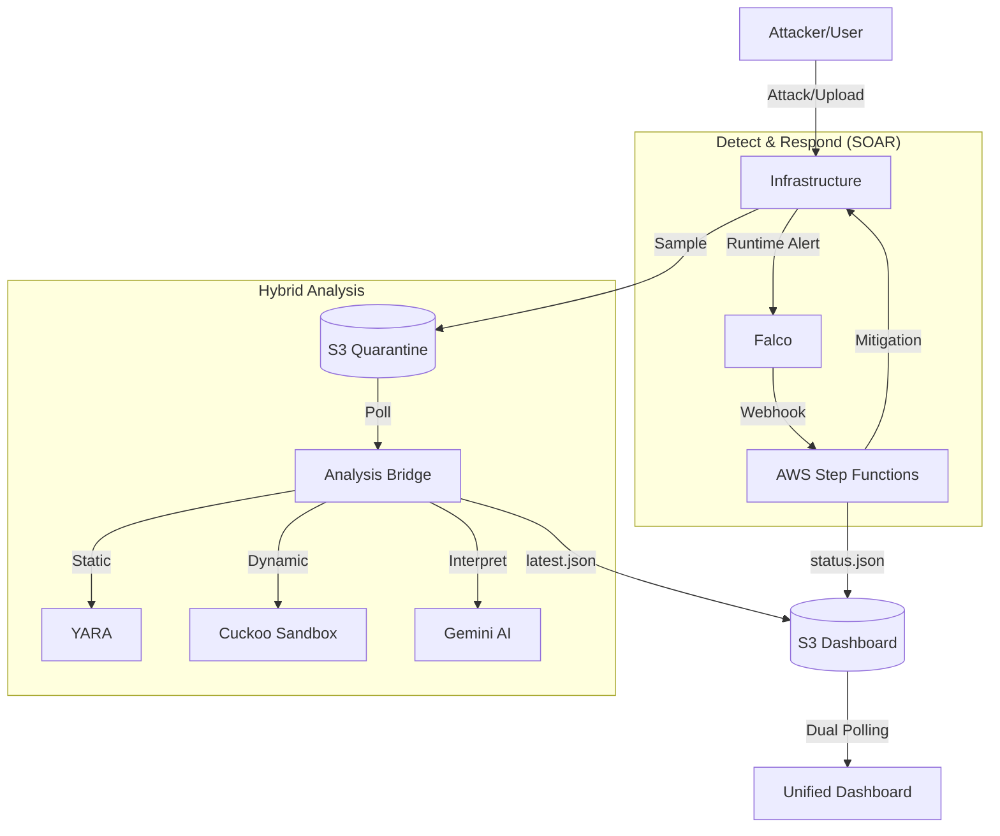

# 5ENTINEL: Integrated Security & Automated Response Platform

**클라우드 네이티브 통합 SOC 및 실시간 위협 대응 생태계**

**5ENTINEL (S.H.I.E.L.D)** 은 현대적인 클라우드(AWS/EKS) 환경을 보호하기 위해 설계된 차세대 통합 보안 관제 플랫폼임.
단순한 모니터링을 넘어 런타임 행위 탐지(Falco), 정적/동적 파일 분석(YARA/Cuckoo), SOAR 자동 대응(Step Functions), 그리고 **AI 분석 지능(Gemini)** 이 하나로 결합된 Full-Stack 보안 응대 시스템을 제공함.

---

## 핵심 기능 (Core Features)

### 1. 실시간 위협 통합 관제 (Unified Monitoring)
*   **Threat Radar**: 위협 점수(Threat Score)를 기반으로 파일 및 런타임 위협을 레이더 화면에 실시간 시각화함.
*   **Emergency Mode**: 활성 사고(Falco 탐지) 발생 시 대시보드 전체 UI가 즉시 붉은색 점멸 긴급 모드로 전환되어 분석가의 인지를 도움.
*   **Pipeline Tracking**: 탐지부터 분석, 격리, 보고까지 이어지는 전체 보안 파이프라인의 진행 상태를 실시간 트래킹함.

### 2. 하이브리드 인텔리전스 분석 (Malware Intelligence)
*   **Static Analysis (YARA)**: 파일 유입 즉시 로컬 엔진을 통해 악성 시그니처, API 패턴, 오프셋 정보를 정밀 스캔함.
*   **Dynamic Analysis (Cuckoo)**: 가상 샌드박스 환경에서 파일의 실제 행위(네트워크 연결, 파일 조작 등)를 추적하여 위험도를 산출함.
*   **AI Summary (Gemini)**: 복잡한 원본 로그를 AI가 분석하여 분석가에게 최적화된 "식별-위험-대응" 3단계 국문 요약 리포트를 제공함.

### 3. 클라우드 네이티브 자동화 대응 (Falco & SOAR)
*   **Runtime Detection**: EKS 컨테이너 내부의 비정상적인 시스템 콜(쉘 실행, 민감 파일 접근 등)을 실시간으로 포착함.
*   **SOAR Logic**: 위협 탐지 즉시 AWS Step Functions를 호출하여 해당 Pod를 격리(NetworkPolicy)하거나 강제 종료함.
*   **Fast-Path**: 고위험 탐지 시 리소스 낭비를 방지하기 위해 샌드박스 분석을 생략하고 즉시 차단하는 최적화 경로를 제공함.


---

## 검증된 공격 시나리오 (Validated Attack Scenarios)

본 시스템은 실제 공격 기법을 시뮬레이션하여 방어 유효성을 검증했음.

### 1. Reverse Shell & Evasion
*   공격자가 웹 취약점을 통해 내부 침투 후 C2 서버로의 역접속을 시도함.
*   단순한 연결뿐만 아니라 우회 기법(Evasion)을 시도했으나, Falco 커스텀 룰을 통해 프로세스 트리와 네트워크 소켓 생성을 상관 분석하여 탐지함.

### 2. DVWA Web Exploitation
*   DVWA를 타겟으로 자동화된 봇 공격 및 웹쉘 업로드 공격을 수행함.
*   웹 서버 프로세스가 쉘을 스폰하거나 비정상적인 경로에 파일을 쓰는 행위를 행위 기반으로 탐지함.

### 3. Container Privilege Escalation
*   침투한 컨테이너 내부에서 권한 상승을 시도함.
*   탐지 즉시 SOAR가 트리거되어 해당 Pod를 네트워크 격리하거나 강제 종료함.

---

## 시스템 아키텍처 (Architecture)

대시보드는 S3 버킷의 데이터를 이원화하여 관리하며, 각 엔진이 실시간으로 상태 정보를 갱신하는 구조임.

*   **latest.json**: YARA/Cuckoo 파일 분석 결과 및 AI 리포트 데이터
*   **status.json**: Falco 실시간 사고 및 SOAR 자동 대응 현황 데이터



---

## 프로젝트 구조 (Repository Structure)

```text
5entinel-platform/
├── dashboard/           # React 기반 통합 관제 프론트엔드 (S3 호스팅)
├── cuckoo/              # 분석 브릿지 엔진 (bridge.py, YARA 연동)
├── falco/               # 런타임 보안 정책 및 FalcoSidekick 설정
└── test/             
```

---

## 기술 스택 (Tech Stack)

| 구분 | 기술 스택 |
| :--- | :--- |
| **Frontend** | React.js, Tailwind CSS, Lucide Icons |
| **Analysis** | YARA (Static), Cuckoo Sandbox (Dynamic) |
| **Cloud** | AWS (EKS, S3, CloudWatch, Lambda, Step Functions) |
| **Security** | Falco (Runtime), Kubernetes NetworkPolicy |
| **AI** | Google Gemini 2.5 Flash API |
| **Languages** | Python (Bridge), JavaScript (UI), YARA Language |

---

## 주요 설정 (Configuration)

플랫폼 전체 연동을 위해 다음 환경 변수 및 설정 확인이 필요함.

*   **AWS S3**: `dashboard-index` (데이터 저장소), `quarantine-cuckoo` (샘플 수집)
*   **Gemini API**: `bridge.py` 내 Google AI Studio API 키 설정
*   **Discord**: 실시간 알림 연동을 위한 Webhook URL 지정
*   **EKS Falco**: Sidekick Webhook 주소를 브릿지 서버 엔드포인트로 연결

---

## 팀원 소개 (Team)

| 이름 | 역할 (Role) | 주요 기여 및 담당 파트 (Key Contributions) |
| :---: | :---: | :--- |
| **이영주** | **Team Leader** | (작성 필요) |
| **신유주** | Member | Cuckoo Sandbox 서버 구축 및 gemini 기반 분석 요약 자동화 연동, 대시보드 설계/구현, 분석 브릿지 개발 및 S3 기반 데이터 파이프라인 구축 |
| **이영광** | Member | QA 및 유닛 테스트(Unit Test) 검증 |
| **이재일** | Member | 아키텍처 설계, Falco 설정, 리버스 쉘 공격 시나리오 설계 |
| **홍정수** | Member | 오픈소스 YARA 룰 활용 및 탐지 자동화 구현, 스크립트(PHP 리버스쉘/PowerShell) 난독화 탐지 |

---

## 라이선스 (License)

본 프로젝트는 보안 교육 및 모니터링 연구 목적으로 제작되었음.
MIT License를 따름.
