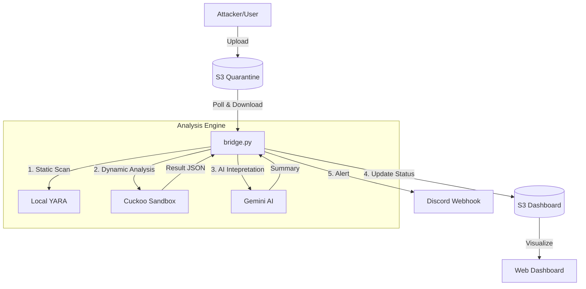

# YARA & Cuckoo Analysis Bridge (`bridge.py`)

이 스크립트는 **S.H.I.E.L.D Sentinel** 플랫폼의 핵심 분석 엔진(Core Analysis Engine)임. 
S3에 업로드된 의심 파일을 자동으로 수집하여 **정적 분석(YARA)** 과 **동적 분석(Cuckoo Sandbox)** 을 수행하고, **Gemini AI**를 통해 결과를 요약하여 대시보드와 디스코드로 전송함.

## 주요 기능

1.  **자동 수집 (Auto-Polling)**
    *   `quarantine-cuckoo` S3 버킷을 모니터링하여 새로운 의심 파일을 감지함.
2.  **하이브리드 분석 (Hybrid Analysis)**
    *   **로컬 YARA**: Python YARA 라이브러리를 사용하여 1차 정적 분석을 수행함.
    *   **Cuckoo Sandbox**: 파일을 샌드박스 서버로 전송하여 2차 동적 행위 분석을 수행함.
3.  **AI 인텔리전스 (Gemini AI)**
    *   분석 결과(시그니처, 행위 로그)를 Google Gemini API로 전송하여 "식별-위험-대응" 3단계 요약을 생성함.
4.  **실시간 전파 (Notification)**
    *   **Dashboard**: 분석 진행 상황(Scan -> Cuckoo -> Complete)을 실시간으로 S3(`latest.json`)에 업데이트함.
    *   **Discord**: 분석이 완료되면 위험도 점수와 AI 요약 리포트를 웹훅으로 전송함.

## 사전 요구사항 (Prerequisites)

이 스크립트를 실행하기 위해서는 다음 환경이 구성되어야 함.

### 1. Python 패키지 설치
```bash
pip install boto3 requests google-generativeai yara-python
```

### 2. Cuckoo Sandbox 서버
*   Cuckoo Sandbox가 API 서버 모드(`cuckoo api`)로 실행 중이어야 함.
*   기본 URL: `http://localhost:8090` (스크립트 내 설정 가능)

## 설정 (Configuration)

`bridge.py` 상단에 있는 설정 변수들을 환경에 맞게 수정해야 함.

```python
# ================= 설정 =================
S3_QUARANTINE   = "quarantine-cuckoo"       # 의심 파일이 업로드되는 버킷
S3_DASHBOARD    = "dashboard-index"         # 대시보드 데이터용 버킷
AWS_REGION      = "us-east-1"
CUCKOO_URL      = "http://localhost:8090"   # Cuckoo API 주소
DISCORD_URL     = "YOUR_DISCORD_WEBHOOK"    # 알림 받을 디스코드 주소
GEMINI_API_KEY  = "YOUR_GEMINI_API_KEY"     # Google AI Studio API 키
YARA_RULES_FILE = "rules.yar"               # 참조할 YARA 룰 파일 경로
# ========================================
```

> **주의:** `YARA_RULES_FILE`의 경로는 스크립트 실행 위치를 기준으로 설정해야 함.

## 실행 방법

### 1. 직접 실행
```bash
python bridge.py
```
실행 시 "AI+Cuckoo 통합 감시 시작" 로그가 출력되며, S3 폴링 루프가 시작됨.

### 2. 백그라운드 서비스로 등록 (Systemd 예시)
실제 운영 환경에서는 Systemd 서비스로 등록하여 상시 실행하는 것을 권장함.

```ini
# /etc/systemd/system/sentinel-bridge.service
[Unit]
Description=5entinel Analysis Bridge
After=network.target

[Service]
Type=simple
User=ubuntu
WorkingDirectory=/path/to/5entinel/cuckoo
ExecStart=/usr/bin/python3 /path/to/5entinel/cuckoo/bridge.py
Restart=always

[Install]
WantedBy=multi-user.target
```

## 데이터 흐름 (Architecture)


