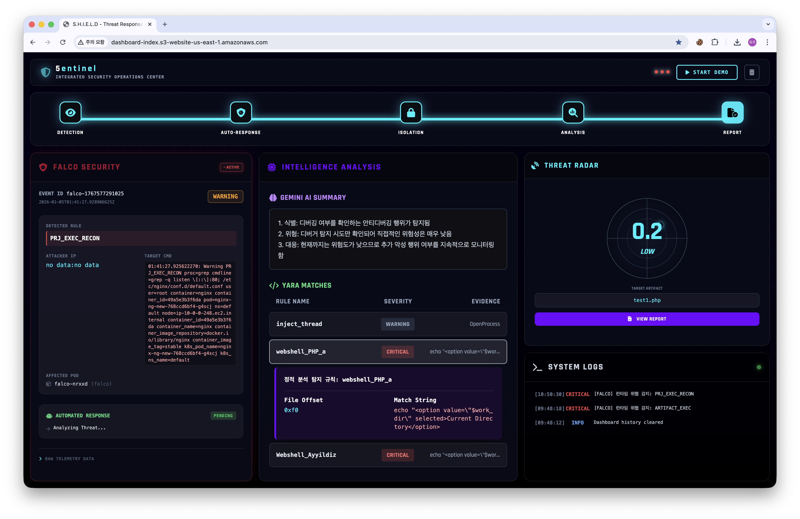
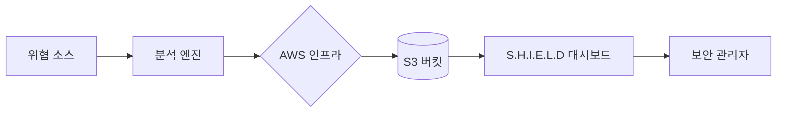

# S.H.I.E.L.D Sentinel Dashboard

### 통합 위협 방어 및 실시간 보안 모니터링 시스템

**S.H.I.E.L.D (5entinel)** 는 정적/동적 파일 분석과 실시간 시스템 런타임 위협 탐지를 결합한 **통합 보안 관제 대시보드**임.
YARA, Cuckoo Sandbox, Falco의 데이터를 시각화하고, **Gemini AI**를 통해 분석 요약을 제공하여 보안 분석가의 신속하고 정확한 의사결정을 지원함.



---

## 주요 기능 (Key Features)

### 1. 실시간 위협 레이더 (Real-time Threat Radar)
-   **위협 점수(Threat Score)** 기반으로 한 직관적인 레이더 시각화
-   점수 구간별 자동 위험 등급 산출 (**Critical, High, Medium, Low, Clean**)
-   파일 업로드 시점부터 분석 완료까지 **상태 실시간 추적**

### 2. 악성코드 인텔리전스 (Malware Intelligence)
-   **정적 분석 (YARA Matches)**: 정적 시그니처 매칭 결과 및 상세 매칭 데이터(Evidence) 노출
-   **동적 분석 (Cuckoo Sandbox)**: 샌드박스 동적 분석 결과와 위험도 점수 연동
-   **Gemini AI 요약**: 복잡한 분석 결과를 **읽기 쉬운 3줄 요약** 형태로 자동 생성하여 제공

### 3. 런타임 사고 모니터링 (Falco & SOAR)
-   **Falco 연동**: 실시간 컨테이너 런타임 보안 사고 탐지 (시스템 콜 레벨)
-   **SOAR 트래커**: AWS Step Functions를 통한 **자동 대응(격리, Pod 종료 등)**  단계 실시간 표시
-   **긴급 모드 (Emergency Mode)**: 보안 사고(Active Incident) 발생 시, UI가 **붉은색 점멸 모드**로 전환되어 즉각적인 인지 유도

### 4. 인터랙티브 활동 피드 (Activity Feed)
-   모든 탐지 및 대응 과정을 **타임스탬프**와 함께 실시간 시스템 로그 형태로 기록
-   중요도에 따른 로그 색상 구분 (**Critical, Info, Warning**)으로 가독성 확보

---

## 기술 스택 (Tech Stack)

*   **Frontend**: React.js, Tailwind CSS
*   **Styling**: Rajdhani & JetBrains Mono Fonts
*   **Intelligence**: Gemini AI API (Flash v2.5)
*   **Monitoring**: Falco, YARA, Cuckoo Sandbox
*   **Infrastructure**: AWS S3, CloudWatch, Step Functions
*   **Alerting**: Discord Webhook Integration

---

## 시스템 아키텍처 및 데이터 흐름

대시보드는 AWS S3 버킷의 JSON 파일을 주기적으로 폴링(Polling)하여 최신 상태를 유지함.

*   `latest.json`: 정적/동적 파일 분석 결과 데이터
*   `status.json`: Falco 탐지 및 SOAR 자동 대응 진행 현황 데이터



---

## 환경 설정 (Configuration)

대시보드 상단의 설정 부분에서 AWS S3 버킷 정보를 본인의 환경에 맞게 수정해야 함.

```javascript
const BUCKET_NAME = "dashboard-index"
const REGION = "us-east-1"
```

---

## 설치 및 실행 방법 (Installation)

별도의 빌드 과정 없이 정적 파일 서버로 실행 가능한 가벼운 구조임.

### 1. 리포지토리 클론
```bash
git clone https://github.com/5entinel-labs/5entinel-security-platform.git
cd 5entinel-dashboard
```

### 2. 로컬 서버 실행
Python 또는 Node.js를 사용하여 실행할 수 있습니다.

**Python:**
```bash
python3 -m http.server 8000
```

**Node.js (serve):**
```bash
npx serve .
```

### 3. 접속
브라우저에서 `http://localhost:8000/index.html` 접속

---

## 데모 모드 (Demo Mode)

실제 공격 발생 전이라도 대시보드의 모든 기능을 시뮬레이션해 볼 수 있음. 

1.  우측 상단 **"START DEMO"** 버튼 클릭
2.  **평시 상태**: 평시 모니터링 상태
3.  **사고 발생**: 사고 시뮬레이션 시작 시 **즉시 긴급 모드(레드)** 전환
4.  **대응 확인**: 상단 파이프라인 바에서 자동 대응 작업(IP 차단, 포드 격리 등) 실시간 확인

---

## License

This project is for **security education and monitoring purposes**.
Licensed under the MIT License.
